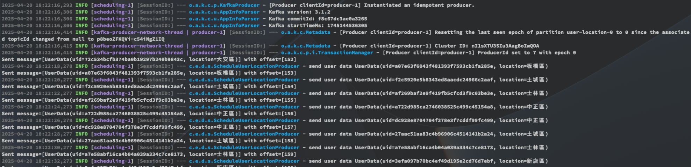
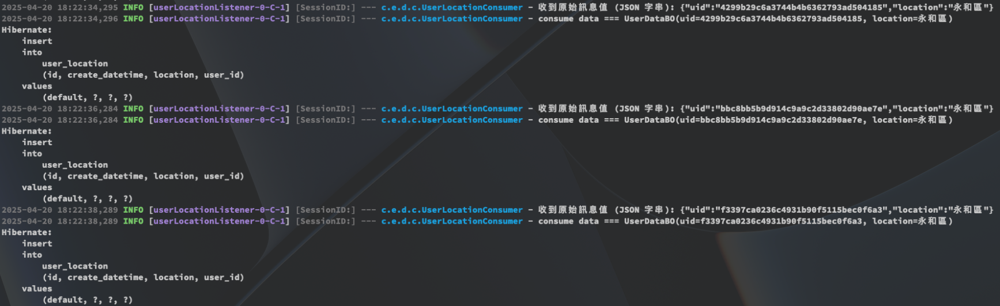
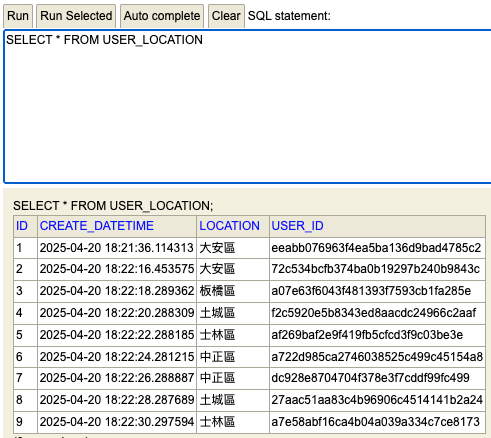
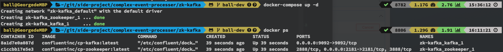

# complex-event-processer
即時事件分析(簡單模擬資料流)  
Spring Boot + Kafka + H2  
利用 Kafka Listener 監聽 Kafka Topic，並將資料寫入 資料庫

=> 模擬 Event Producer

Publish User Location Event to Kafka topic

=> 模擬 Event Consumer

Consume User Location Event from Kafka topic and save to H2 database


=> 使用 docker-compose 啟動 Kafka 和 Zookeeper
```bash
docker-compose up -d
```


